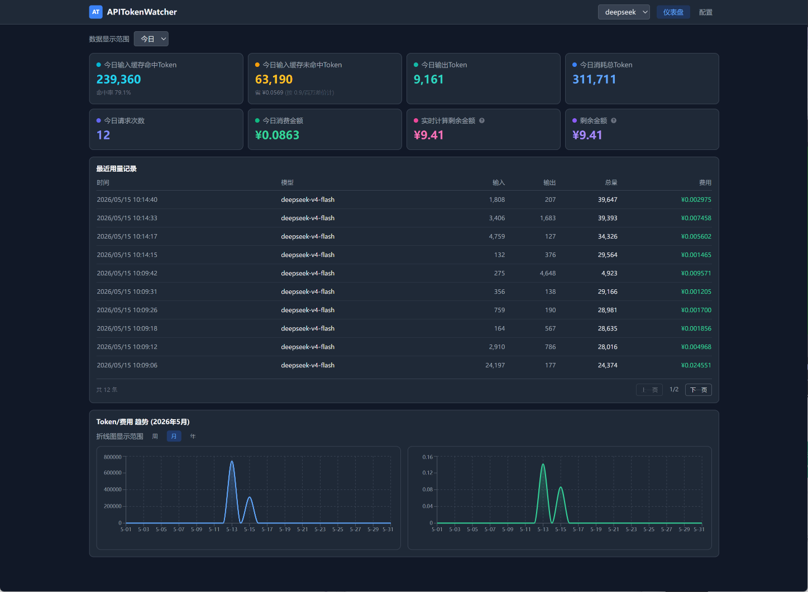
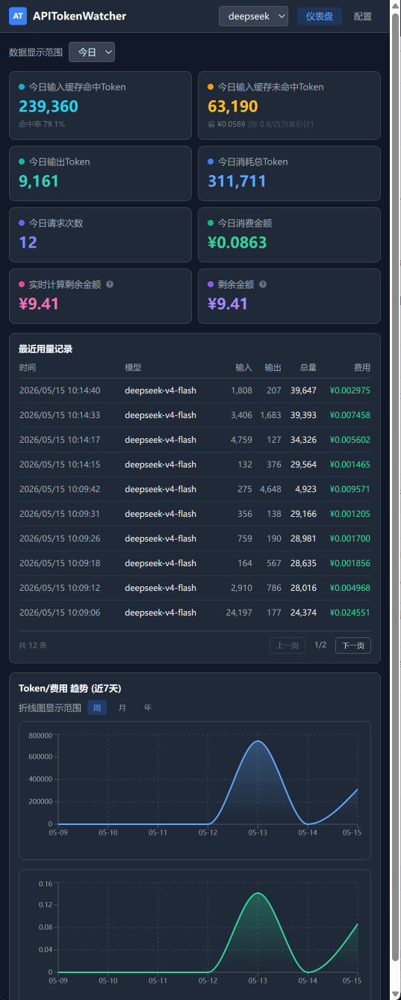
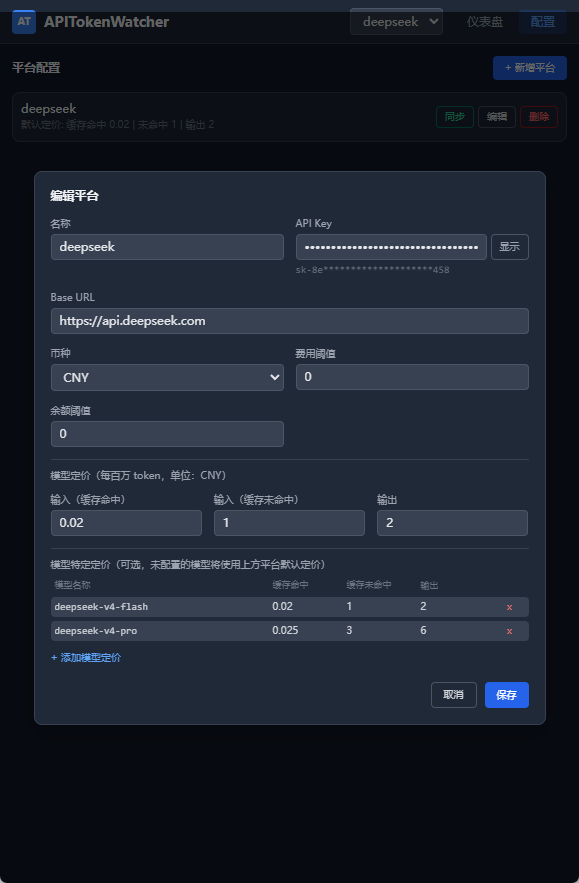

# APITokenWatcher

多 API 平台 Token 用量实时监控工具。通过代理层拦截 API 请求，自动记录各平台 Token 消耗与费用，提供可视化仪表盘、阈值告警与桌面通知。

## 功能特性

- **实时监控**：通过代理层自动记录每次 API 请求的 Token 用量和费用
- **多平台支持**：目前支持 DeepSeek OpenAI 兼容接口
- **模型级定价**：同一平台可配置多个模型的独立定价（如 deepseek-v4-flash、deepseek-v4-pro），计费时自动按模型匹配价格，未匹配则回退到平台默认价格
- **余额双重追踪**：剩余额度每 5 分钟从平台 API 同步真实余额；实时计算剩余额度根据每次请求实时扣减
- **灵活时间筛选**：支持今日/本周/本月/累计四种时间维度查看统计数据
- **可视化仪表盘**：8 项核心指标彩色卡片（宽屏 4 列、窄屏 2 列自适应），支持周/月/年维度的 Token 与费用趋势图、最近用量记录
- **缓存监控**：实时显示缓存命中/未命中 token 数及节省费用估算
- **阈值告警**：余额不足、费用超限时自动提醒
- **桌面应用**：基于 pywebview 的桌面窗口，方便挂在屏幕角落

## 界面展示

### 仪表盘宽屏



### 仪表盘窄屏



### 平台配置



### CC Switch 配置


## 快速开始

### 方式一：直接使用（推荐）

下载项目根目录下的 `APITokenWatcher.zip`，解压后双击 `APITokenWatcher.exe` 即可运行。无需安装 Python 或 Node.js。

### 方式二：从源码运行

#### 环境要求

- Python 3.10+
- Node.js 16+

#### 安装依赖

```bash
# 安装 Python 依赖
pip install -r requirements.txt

# 安装前端依赖并构建
cd frontend
npm install
npm run build
cd ..
```

#### 启动应用

```bash
python run.py
```

Windows 下也可直接双击 `启动.bat` 以无窗口模式运行。

启动后会打开桌面窗口，首次使用需要在「配置」页面添加平台配置。

### 构建 exe

```bash
# 一键构建（自动构建前端 + 打包 exe）
build.bat
```

构建产物在 `dist/APITokenWatcher/` 目录，整个文件夹可直接分享给他人使用。

## 配置说明

### 添加平台

1. 打开应用，点击「配置」标签
2. 点击「新增平台」
3. 填写以下信息：
   - **名称**：平台标识（如 `deepseek`）
   - **API Key**：你的 API 密钥
   - **Base URL**：API 地址（如 `https://api.deepseek.com`）
   - **初始余额**：可选，或使用「同步余额」自动获取
   - **平台默认定价**：缓存命中输入、缓存未命中输入、输出三个价格
4. （可选）在「模型特定定价」区域添加具体模型的独立定价：
   - 点击「+ 添加模型定价」
   - 填写模型名称（如 `deepseek-v4-flash`）及三个对应价格
   - 可添加多个模型，每个模型使用各自的价格计费
   - 未配置的模型自动使用上方的平台默认定价
5. 保存后，点击「同步余额」获取真实余额

### 配置 CC Switch

如果你使用 CC Switch 连接 Claude Code：

1. 打开 CC Switch 设置
2. 将「请求地址」改为：
   ```
   http://127.0.0.1:8766/proxy/deepseek
   ```
3. API 格式选择「Anthropic Messages (原生)」
4. 保存并测试

## 项目结构

```
APITokenWatcher/
├── backend/                 # FastAPI 后端
│   ├── main.py             # 应用入口
│   ├── models.py           # 数据模型
│   ├── database.py         # 数据库配置
│   ├── config.py           # 配置管理
│   ├── routers/            # API 路由
│   │   ├── proxy.py        # 代理服务（核心）
│   │   ├── config.py       # 平台配置
│   │   ├── usage.py        # 用量统计
│   │   └── alerts.py       # 告警管理
│   ├── services/           # 业务逻辑
│   │   ├── cost.py         # 费用计算
│   │   ├── monitor.py      # 定时任务
│   │   ├── balance.py      # 余额同步
│   │   └── notifier.py     # 通知服务
│   └── static/             # 构建后的前端静态文件
├── frontend/               # React 前端 (Vite + TypeScript)
│   ├── src/
│   │   ├── main.tsx        # 入口
│   │   ├── App.tsx         # 主界面
│   │   ├── api.ts          # API 封装
│   │   ├── index.css       # Tailwind 样式
│   │   ├── components/     # UI 组件
│   │   │   ├── Dashboard.tsx
│   │   │   ├── ConfigPanel.tsx
│   │   │   ├── UsageChart.tsx
│   │   │   ├── RecentRecords.tsx
│   │   │   └── AlertBanner.tsx
│   │   └── hooks/
│   │       └── usePolling.ts  # 轮询 hook
│   └── package.json
├── picture/                # 界面截图
│   ├── 仪表盘宽屏.png
│   ├── 仪表盘窄屏.png
│   ├── 平台配置.png
│   └── cc swith配置.png
├── APITokenWatcher.zip     # 可分发的压缩包（解压后双击 exe 即可使用）
├── dist/                   # 构建产物
│   └── APITokenWatcher/    # exe 及依赖
├── run.py                  # 启动脚本
├── build.bat               # 一键构建脚本
├── APITokenWatcher.spec    # PyInstaller 配置
├── requirements.txt        # Python 依赖
├── 启动.bat                # Windows 无窗口启动
└── .gitignore
```

## Token 统计与费用计算逻辑

### 整体流程

```
API 请求 → 代理层拦截 → 提取 usage 数据 → 计算费用 → 写入数据库 → 实时扣减余额
                  ↓
          每 5 分钟定时同步真实余额校准
```

### 1. 数据采集（代理拦截）

所有 API 请求通过 `backend/routers/proxy.py` 中的代理层转发，在响应返回前截取用量数据。

**非流式请求**：直接从 JSON 响体的 `usage` 字段提取。

**流式请求（SSE）**：逐行解析 `data:` 事件，提取末尾的 `usage` 信息：
- **OpenAI 格式**：最后一个 `data:` 块中的 `usage` 字段
- **Anthropic 格式**：`message_delta` 事件中的 `usage` 字段

支持两种命名规范自动映射：

| 语义 | OpenAI 字段 | Anthropic 字段 |
|------|-------------|----------------|
| 输入 Token | `prompt_tokens` | `input_tokens` |
| 输出 Token | `completion_tokens` | `output_tokens` |
| 缓存命中 | `prompt_cache_hit_tokens` | `cache_read_input_tokens` |
| 缓存未命中 | `prompt_cache_miss_tokens` | `cache_creation_input_tokens` |

### 2. DeepSeek v4 特殊处理

DeepSeek v4 模型中 `prompt_cache_miss_tokens` 始终为 0，`prompt_tokens` 仅表示非缓存部分的 token 数。因此当检测到缓存命中数 > 0 时，将 `prompt_tokens` 作为缓存未命中值参与计费。

### 3. 费用计算公式

```
费用 = (cache_hit_tokens × cache_hit_price +
        cache_miss_tokens × cache_miss_price +
        completion_tokens × output_price) / 1_000_000
```

各平台可在配置页面独立设置单价（每百万 token 的价格）。同时支持**模型级定价**：若为某模型配置了独立价格，则优先使用模型价格；未配置则回退到平台默认价格。

默认值：

| 价格项 | 默认值（USD/百万 token） |
|--------|------------------------|
| 缓存命中输入 | $0.02 |
| 缓存未命中输入 | $1.00 |
| 输出 | $2.00 |

### 4. 余额双重追踪

系统采用 **实时扣减 + 定时校准** 的双重机制：

- **实时扣减**：每次代理请求记录用量后，立即从 `provider.initial_balance` 扣除本次费用（见 `proxy.py:77`）
- **定时校准**：每 5 分钟调用平台官方余额 API（如 DeepSeek `/user/balance`）同步真实余额，覆盖本地余额值

这种方式既保证了余额变化的实时可见性，又避免了长时间累积误差。

### 5. 统计聚合查询

通过 `backend/routers/usage.py` 提供三种粒度的数据接口：

**摘要统计** (`/api/usage/summary`)：按今日/本周/本月/累计四个维度返回：
- 总 Token 数、输出 Token 数、总费用、请求次数
- 缓存命中/未命中 Token 数
- 剩余余额、实时费用（应用启动后累计）

**趋势数据** (`/api/usage/trend`)：按小时/天/月/年分组，返回每个时间段的 Token 数和费用，用于折线图展示。

**最近记录** (`/api/usage/records`)：分页查询最近用量明细，支持按时间范围筛选。

所有的统计查询均基于 SQLite 数据库的聚合函数（`SUM`、`COUNT`），按 `provider_id` 和时间范围过滤。

### 6. 缓存监控

系统自动追踪两类缓存数据：
- **缓存命中**：`prompt_cache_hit_tokens` — 命中缓存的输入 token，按低价计费
- **缓存未命中**：`prompt_cache_miss_tokens` — 未命中缓存的输入 token，按标准价计费

缓存节省的费用 ≈ 缓存命中 token 数 × (cache_miss_price - cache_hit_price) / 1_000_000，在仪表盘实时显示。

### 7. 告警机制

每 5 分钟定时检查（`backend/services/monitor.py`）：
- **余额告警**：当剩余余额 ≤ 阈值时触发（仅触发一次，直到被确认）
- **费用告警**：当今日累计费用 ≥ 阈值时触发

告警记录写入 `alert_log` 表，同时通过桌面通知提醒用户。

## 技术栈

- **后端**：FastAPI、SQLModel、SQLite、APScheduler
- **前端**：React、TypeScript、Vite、Tailwind CSS、Recharts
- **桌面**：pywebview

## 数据存储

### 数据库文件

- **位置**：项目根目录下的 `data.db`
- **类型**：SQLite
- **安全**：已在 `.gitignore` 中排除，**请勿提交到 Git**

### 数据库结构

#### provider_config（平台配置表）

| 字段 | 类型 | 说明 |
|------|------|------|
| id | INTEGER | 主键，自增 |
| name | VARCHAR | 平台标识（如 `deepseek`） |
| api_key | VARCHAR | **API 密钥（敏感信息）** |
| base_url | VARCHAR | API 地址 |
| initial_balance | FLOAT | 真实余额（每次调用实时扣减，每 5 分钟从 API 同步校准） |
| balance_currency | VARCHAR | 余额币种（如 `CNY`、`USD`） |
| alert_threshold_cost | FLOAT | 费用告警阈值 |
| alert_threshold_balance | FLOAT | 余额告警阈值 |
| is_enabled | BOOLEAN | 是否启用 |
| pricing_cache_hit_input | FLOAT | 缓存命中输入价格（每百万 token） |
| pricing_cache_miss_input | FLOAT | 缓存未命中输入价格（每百万 token） |
| pricing_output | FLOAT | 输出价格（每百万 token） |
| created_at | DATETIME | 创建时间 |
| updated_at | DATETIME | 更新时间 |

#### model_pricing（模型定价表）

| 字段 | 类型 | 说明 |
|------|------|------|
| id | INTEGER | 主键，自增 |
| provider_id | INTEGER | 关联的平台 ID（外键 → provider_config.id） |
| model_name | VARCHAR | 模型名称（如 `deepseek-v4-flash`），同平台下不可重复 |
| pricing_cache_hit_input | FLOAT | 缓存命中输入价格（每百万 token） |
| pricing_cache_miss_input | FLOAT | 缓存未命中输入价格（每百万 token） |
| pricing_output | FLOAT | 输出价格（每百万 token） |
| created_at | DATETIME | 创建时间 |
| updated_at | DATETIME | 更新时间 |

#### usage_record（用量记录表）

| 字段 | 类型 | 说明 |
|------|------|------|
| id | INTEGER | 主键，自增 |
| provider_id | INTEGER | 关联的平台 ID |
| timestamp | DATETIME | 请求时间 |
| model | VARCHAR | 模型名称 |
| prompt_tokens | INTEGER | 输入 token 数 |
| completion_tokens | INTEGER | 输出 token 数 |
| prompt_cache_hit_tokens | INTEGER | 缓存命中 token 数 |
| prompt_cache_miss_tokens | INTEGER | 缓存未命中 token 数 |
| total_tokens | INTEGER | 总 token 数 |
| cost_usd | FLOAT | 费用（USD） |

#### alert_log（告警日志表）

| 字段 | 类型 | 说明 |
|------|------|------|
| id | INTEGER | 主键，自增 |
| provider_id | INTEGER | 关联的平台 ID |
| alert_type | VARCHAR | 告警类型（`balance_low` / `cost_threshold`） |
| message | VARCHAR | 告警内容 |
| triggered_at | DATETIME | 触发时间 |
| acknowledged | BOOLEAN | 是否已确认 |

### API Key 安全

> **重要**：API Key 存储在 `data.db` 数据库的 `provider_config` 表中。
> 如果需要查看或修改 API Key，请直接操作数据库，**不要**将数据库文件提交到版本控制。

查看 API Key：
```bash
python -c "
import sqlite3
conn = sqlite3.connect('data.db')
cursor = conn.cursor()
cursor.execute('SELECT id, name, api_key FROM provider_config')
for row in cursor.fetchall():
    print(f'ID: {row[0]}, Name: {row[1]}, API Key: {row[2]}')
conn.close()
"
```

手动更新 API Key：
```bash
python -c "
import sqlite3
conn = sqlite3.connect('data.db')
cursor = conn.cursor()
cursor.execute(\"UPDATE provider_config SET api_key = 'sk-your-new-key' WHERE name = 'deepseek'\")
conn.commit()
print('API Key updated')
conn.close()
"
```

## 开发模式

```bash
# 后端（热重载）
cd backend
uvicorn main:app --reload --host 127.0.0.1 --port 8766

# 前端（Vite 开发服务器）
cd frontend
npm run dev
```

开发时后端代理层默认监听 `8766` 端口，前端 Vite 开发服务器默认 `5173` 端口。生产构建前端文件输出到 `backend/static/`，由 FastAPI 直接托管。

## 许可证

MIT License
